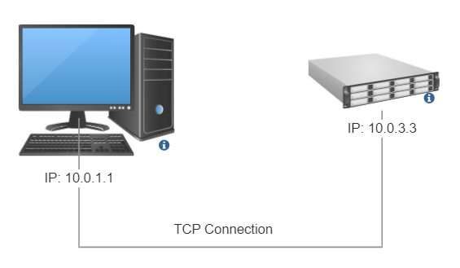
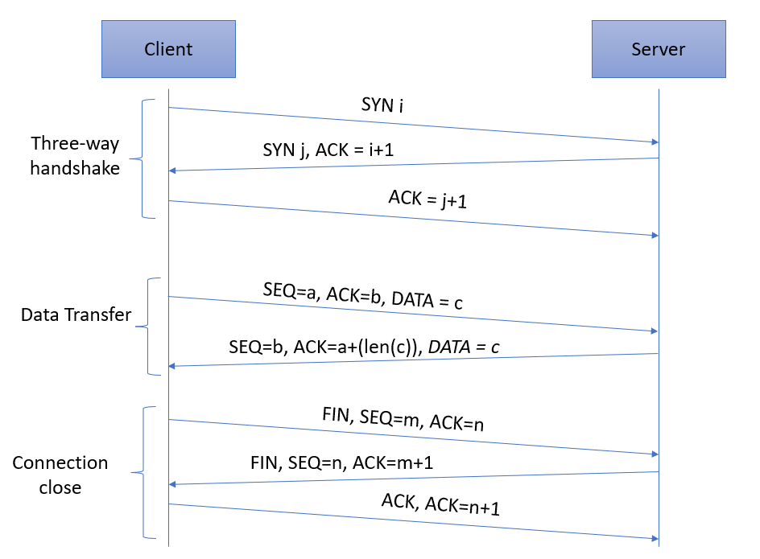

# Implementing simple TCP endpoint in p4

## Introduction

The objective of this exercise is to write a P4 program that
implements a simple TCP endpoint in P4. The switch currently performs the following actions:
1. Three-way handshake​
2. State maintenance​
3. ACKs to incoming packets​
6. Connection close​​

I used the P4 language tutorial files as a start and is available [here](https://github.com/p4lang/tutorials/tree/master/exercises/basic) .
This P4 program is written for the V1Model architecture implemented
on P4.org's bmv2 software switch. The architecture file for the V1Model
can be found at: /usr/local/share/p4c/p4include/v1model.p4. This file
desribes the interfaces of the P4 programmable elements in the architecture,
the supported externs, as well as the architecture's standard metadata
fields.

I used the following topology for this exercise. It is a single host with a switch situation:



## Implementation

The files under /pod-topo contain the architecture descriptor files.
The basic.p4 file contains the implementation.


TCP connection packet flow in this implementation:


### Routing
The switch has to act as a server, therefore the packets it receives must be rerouted to its source address.
I implemented a simple `send_back()` function for the IP header routing variable changes.
The TCP header addresses are currently switched in the response creation functions.

### Three-way handshake​
I introduced two bloom filters to identify which address sent us already a SYN packet (as the first packet of the three-way handshake (named `bloom_filter_syn` )) 
and which address has an already established connection (named `bloom_filter_conn`).
The filter's first field is the hashed IP and port, the second is a bit that represents the boolean value (eg. if received, then 1, if not, then 0).
The SYN-ACK packet's values are modified according to the image above.
As we receive the ACK after the SYN (as the last packet of the TCP handshake), the connection is handled as established.

### Data flow
For the established connections it is simply sends back and ACK response, its values are configured as shown in the figure above.

In the current implementation the data packet travels back to the client. (No truncation).

### Connection close​​
For the established connections if a FIN packet is received, the boolean value in the bloom filters are changed to 0, so the connection now handled as closed,
and a basic ACK response is sent back with the FIN flag set to true.


## Running the code

1. In your shell, run:
   ```bash
   make run
   ```
   This will:
   * compile `basic.p4`, and
   * start the pod-topo in Mininet and configure all switches with
   the appropriate P4 program + table entries, and
   * configure all hosts with the commands listed in
   [pod-topo/topology.json](./pod-topo/topology.json)

2. You should now see a Mininet command prompt. Try to talk to the server which IP address is 10.0.3.3:
   ```bash
   mininet> xterm h1
   "Node: h1"> nc 10.0.3.3 <ANY_PORT>
   ```
	The server currently sends back the data which it received.
	If you would like to check the packets, just open another terminal to the host, 
	save the traffic with tcpdump and open the file with wireshark:
   ```bash
   mininet> xterm h1
   "Node: h1"> tcpdump -w output.pcap -i any
   "Node: h1"> wireshark output.pcap
   ```
3. Type `exit` to leave each xterm and the Mininet command line.
   Then, to stop mininet:
   ```bash
   make stop
   ```
   And to delete all pcaps, build files, and logs:
   ```bash
   make clean
   ```


### Further work

1. Implement packet truncation, meaning that the server eats the incoming bytes, so a plain ACK is sent back only to the received DATA packets.
   Ides for implementation:
	- P4 provides a `truncate(<bit32>length)` function. 
	- In the IP header, the totalLen field must be updated (subtract the payload length).
	- The TCP checksum calculation must be updated to the correct values, without the payload.
2. Three way handshake:
	- Checking the ACK number after the SYN packet

### A note about the control plane

A P4 program defines a packet-processing pipeline, but the rules
within each table are inserted by the control plane. When a rule
matches a packet, its action is invoked with parameters supplied by
the control plane as part of the rule.

In this exercise, as I already meantioned I used the P4 language tutorial which had the controlplane already implemented.
 As part of bringing up the Mininet instance, the
`make run` command will install packet-processing rules in the tables of
each switch. These are defined in the `sX-runtime.json` files, where
`X` corresponds to the switch number.

**Important:** We use P4Runtime to install the control plane rules. The
content of files `sX-runtime.json` refer to specific names of tables, keys, and
actions, as defined in the P4Info file produced by the compiler (look for the
file `build/basic.p4.p4info.txt` after executing `make run`). Any changes in the P4
program that add or rename tables, keys, or actions will need to be reflected in
these `sX-runtime.json` files.

## Relevant Documentation

The documentation for P4_16 and P4Runtime is available [here](https://p4.org/specs/)

All excercises in this repository use the v1model architecture, the documentation for which is available at:
1. The BMv2 Simple Switch target document accessible [here](https://github.com/p4lang/behavioral-model/blob/master/docs/simple_switch.md) talks mainly about the v1model architecture.
2. The include file `v1model.p4` has extensive comments and can be accessed [here](https://github.com/p4lang/p4c/blob/master/p4include/v1model.p4).